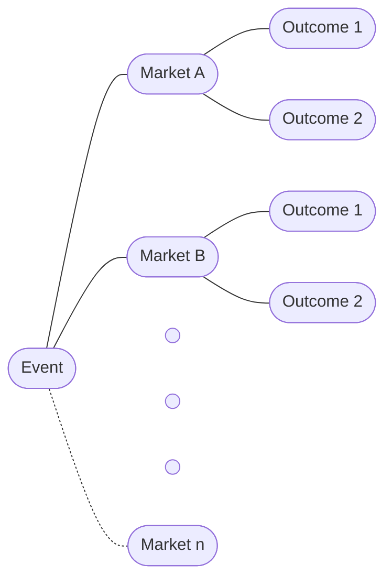

# polymarket-apis 

Unified Polymarket APIs with Pydantic data validation - Clob, Gamma, Data, Web3, Websockets, GraphQL clients.

## Polymarket Mental Models

### Events, Markets and Outcomes

The Polymarket ecosystem is organized hierarchically:

- **Event** — represents a proposition or question such as “How many Fed rate cuts in 2025?”.  
  - Identified by a human-readable **`slug`** (e.g. `how-many-fed-rate-cuts-in-2025`) and an **event `id`** (e.g. `16085`).

- **Market** — represents a specific option for the related event (e.g. 1 rate cut in 2025). An Event has 1 or more corresponding Markets. (e.g. 9 options in this case - {0, 1, 2, ..., 7, 8 or more} rate cuts in 2025)
  - Identified by a **`condition id`** (e.g. `0x8e9b6942b4dac3117dadfacac2edb390b6d62d59c14152774bb5fcd983fc134e` for 1 rate cut in 2025), a human-readable **`slug`** (e.g. `'will-1-fed-rate-cut-happen-in-2025'`) and a **market `id`** (e.g. `516724`).

- **Outcome** — represents a binary option related to a market. (most commonly `Yes`/`No`, but can be e.g. `Paris Saint-Germain`/`Inter Milan` in the case of a match where draws are not possible)
  - Identified by a **`token id`** (e.g. `15353185604353847122370324954202969073036867278400776447048296624042585335546` for the `Yes` outcome in the 1 rate cut in 2025 market)

- The different APIs represent Events/Markets differently (e.g. Event, QueryEvent / ClobMarket, GammaMarket, RewardsMarket) but they all use to the same underlying identifiers.

### Tokens
- **Tokens** are the blockchain implementation of **Outcomes** - tradable digital assets on the Polygon blockchain that users buy, hold and sell on Polygon. 
- This helps ensure the logic of binary outcome prediction markets through smart contracts (e.g. collateralization, token prices going to $1.00 or $0.00 after resolution, splits/merges).

### Splits and Merges
- Holding 1 `Yes` share + 1 `No` share in a **Market** (e.g. `'will-1-fed-rate-cut-happen-in-2025'`) covers the entire universe of possibilities and guarantees a $1.00 payout regardless of outcome. This mathematical relationship enables Polymarket's core mechanisms: splitting (1 USDC → 1 `Yes` + 1 `No`) and merging (1 `Yes` + 1 `No` → 1 USDC) at any point before resolution.
- Splits are the only way tokens are created. Either a user splits USDC into equal shares of the complementary tokens or Polymarket automatically splits USDC when it matches an `Yes` buy order at e.g. 30¢ with a `No` buy order at 70¢.

### Unified Order Book
- Polymarket uses traditional exchange mechanics - a Central Limit Order Book (CLOB), where users place buy and sell orders that get matched by price and time priority.
- However, because the `Yes` and `No` outcomes form a complete probability universe, certain orders become mathematically equivalent - allowing the matching engine to find trades as exemplified above.
- This unified structure means every **BUY** order for `Outcome 1` at price **X** is simultaneously visible as a **SELL** order for `Outcome 2` at price **(100¢ - X)**, creating deeper liquidity and tighter spreads than separate order books would allow.

### Negative Risk and Conversions
- If the **Markets** in and **Event** collectively cover a complete universe of possibilities (e.g. {0, 1, 2, ..., 7, 8 or more} rate cuts in 2025) and only one winner is possible, two collections of positions (made up of tokens and USDC) become mathematically equivalent and the **Event** is said to support negative risk.
  - e.g. Hold 1 `No` token in the 0 rate cuts in 2025. This is equivalent to holding 1 `Yes` token in each of the other **Markets** {1, 2, ..., 7, 8 or more}.
- An interesting consequence is that holding `No` tokens in more than one **Market** is equivalent to `Yes` tokens ***and*** some USDC.
  - e.g. Hold 1 `No` token on each of {0, 1, 2, ..., 7, 8 or more} rate cuts in 2025. Because only one winner is possible, this guarantees that 8 out of the 9 **Markets** resolve to `No`. This is equivalent to a position of 8 USDC.
  - e.g. Hold 1 `No` token on each of {0, 1} rate cuts in 2025. This is equivalent to 1 `Yes` token in {2, ..., 7, 8 or more} and 1 USDC.
- Polymarket allows for the one way (for capital efficiency) conversion from `No` tokens to a collection of `Yes` tokens and USDC before resolution through a smart contract.

## Clients overview
- ### PolymarketClobClient - Order book related operations
  - #### Order book
    - get one or more order books, best price, spread, midpoint, last trade price by `token_id`(s)
  - #### Orders
    - create and post limit or market orders
    - cancel one or more orders by `order_id`(s)
    - get active orders
  - #### Trades
    - get trade history for a user with filtering by `condition_id`, `token_id`, `trade_id`, time window
  - #### Rewards
    - check if one or more orders are scoring for liquidity rewards by `order_id`(s)
    - get daily earned rewards
    - check if a **Market** offers rewards by `condition_id` - **get_market_rewards()**
    - get all active markets that offer rewards sorted by different metrics and ordered, filtered by a query, show your favourites from the web app  - **get_reward_markets()** (*naming would do with some work*)
  - #### Miscellaneous
    - get price history
    - get **ClobMarket** by `condition_id`
    - get all **ClobMarkets**

  ### PolymarketGammaClient - Market/Event related operations
    - #### Market
      - get **GammaMarket** by `market_id`
      - get **GammaMarket** by `slug`
      - get **GammaMarkets** with pagination (offset and limit), filter by `slug`s, `market_id`s, `token_id`s, `condition_id`s, `tag_id` or filtered by active, closed, archived, liquidity window, volume window, start date window, end date window and ordered
      - get **Tags** for a **Market** by `market_id`
    - #### Event
      - get **Event** by `event_id`
      - get **Event** by `slug`
      - get **Events** with pagination, filter by `slug`s, `event_id`s, `tag_id` or filtered by active, closed, archived, liquidity window, volume window, start date window, end date window and ordered
      - get all **Events** given some filtration
      - search **Events**, **Tags**, **Profiles**, filter by text query, tags, active/resolved, recurrence, sort by volume/volume_24hr/liquidity/start_date/end_date/competitive
      - grok event summary by **Event** `slug`
      - grok election market explanation by candidate name and election title
      - get **Tags** for an **Event** by `event_id`
    - #### Tag
      - get **Tags** with pagination, order by any **Tag** field
      - get all **Tags**
      - get **Tag** by `tag_id`
      - get **Tag** relations by `tag_id` or `slug`
      - get **Tags** related to a **Tag** by `tag_id` or `slug`
    - #### Sport
      - get **Teams** with pagination, filter by `league`, `name`, `abbreviation`
      - get all **Teams** given some filtration
      - get **Sports** with pagination, filter by `name`
      - get **Sports** metadata
    - #### Series
      - get **Series** with pagination, filter by `slug`, closed status, order by any **Series** field
      - get all **Series** given some filtration
    - #### Comments
      - get comments by `parent_entity_type` and `parent_entity_id` with pagination, order by any **Comment** field
      - get comments by `comment_id` - gets all comments in a thread.
      - get comments by user base address (not proxy address) with pagination, order by any **Comment** field

  ### PolymarketDataClient - Portfolio related operations
  - #### Positions
    - get positions with pagination (offset and limit) by user address, filter by `condition_id`, position size, redeemability, mergeability, title
  - #### Trades
    - get trades with pagination, filter by `condition id`, user address, side, taker only or not, cash amount/token amount
  - #### Activity
    - get activity with pagination by user address, filter by type (trade, split, merge, redeem, reward, conversion), `condition_id`, time window, side, sort by timestamp/tokens/cash
  - #### Holders
    - get top holders by `condition_id`
  - #### Value
    - get positions value by user address and condition_ids
      - `condition_ids` is ***None*** → total value of positions
      - `condition_ids` is ***str*** → value of positions on a market
      - `condition_ids` is ***list[str]*** → sum of values of positions on multiple markets
  - #### Closed positions
    - get closed positions, filter by condition_ids
  - #### Miscellaneous
    - get total number of markets traded by user address
    - get open interest for a list of condition_ids
    - get live volume for an event by `event_id`
    - get pnl timeseries by user address for a period (1d, 1w, 1m, all) with frequency (1h, 3h, 12h, 1d)
    - get overall pnl/volume by user address for a recent window (1d, 7d, 30d, all)
    - get user rank on the profit/volume leaderboards by user address for a recent window (1d, 7d, 30d, all)
    - get top users on the profit/volume leaderboards (at most 100) for a recent window (1d, 7d, 30d, all)

  ### PolymarketWeb3Client - Blockchain related operations
  - #### Supporting both Email/Magic wallets (signature_type=1) and Safe/Gnosis wallets (signature_type=2)
  - #### Balance
    - get usdc balance by user address
    - get token balance by `token_id` and user address
  - #### Token/USDC conversions
    - split USDC into complementary tokens - needs `condition_id`, amount, neg_risk bool
    - merge complementary tokens into USDC - needs `condition_id`, amount, neg_risk bool
    - redeem token into USDC - needs `condition_id`, amounts array [`Yes` shares, `No` shares], neg_risk bool
    - convert 1 or more `No` tokens in a *negative risk* **Event** into a collection of USDC and `Yes` tokens on the other **Markets** in the **Event**

  ### PolymarketWebsocketsClient - Real time data subscriptions
  - subscribe to **market socket** with `token_ids` list, receive different event types:
    - order book summary
    - price change
    - tick size change
    - last trade price
  - subscribe to **user socket** with **ApiCreds**, receive different event types:
    - order (status - live, canceled, matched)
    - trade (status - matched, mined, confirmed, retrying, failed)
  - subscribe to **live data socket** with any combination described [here](https://github.com/Polymarket/real-time-data-client?tab=readme-ov-file#subscribe) - ***newest endpoint*** - includes the other sockets, receive:
    - all of the above event types
    - market (created, resolved)
    - comment/reaction (created, removed)
    - trades/orders_matched (all, not just yours) - filter by **Event** `slug` or **Market** `slug`
    - crypto price
    - request/quote (created, edited, canceled, expired) - rqf not public yet

  ### PolymarketGraphQLClient/AsyncPolymarketGraphQLClient - Goldsky hosted Subgraphs queries
  - instantiate with an endpoint name from:
    - activity_subgraph
    - fpmm_subgraph
    - open_interest_subgraph
    - orderbook_subgraph
    - pnl_subgraph
    - positions_subgraph
    - sports_oracle_subgraph
    - wallet_subgraph
  - ****query()**** takes in a GraphQL query string and returns the raw json