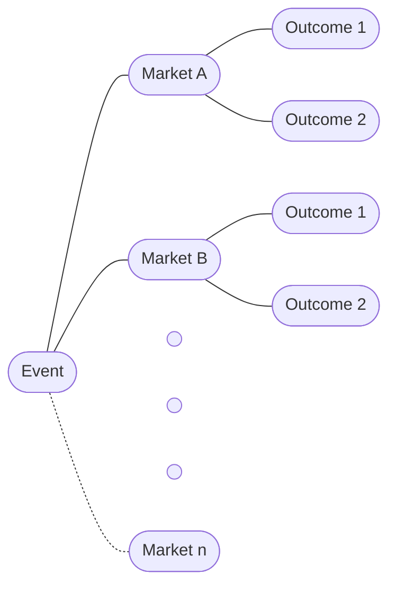

# polymarket-apis 

Unified Polymarket APIs with Pydantic data validation - Clob, Gamma, Data, Web3, Websockets, GraphQL clients.

## Polymarket Mental Models

### Events, Markets and Outcomes

The Polymarket ecosystem is organized hierarchically:

```mermaid
flowchart LR
    A([Event]) --- B([Market A])
    A --- C([Market B])
    A ~~~ Dot1@{ shape: sm-circ}
    A ~~~ Dot2@{ shape: sm-circ}
    A ~~~ Dot3@{ shape: sm-circ}
    A -.- D([Market n])
    B --- E([Outcome 1])
    B --- F([Outcome 2])
    C --- G([Outcome 1])
    C --- H([Outcome 2])
```

- **Event** — represents a proposition or question such as “How many Fed rate cuts in 2025?”.  
  - Identified by a human-readable **`slug`** (e.g. `how-many-fed-rate-cuts-in-2025`) and an **event `id`** (e.g. `16085`).

- **Market** — represents a specific option for the related event (e.g. 1 rate cut in 2025). An Event has 1 or more corresponding Markets. (e.g. 9 options in this case - {0, 1, 2, ..., 7, 8 or more} rate cuts in 2025)
  - Identified by a **`condition id`** (e.g. `0x8e9b6942b4dac3117dadfacac2edb390b6d62d59c14152774bb5fcd983fc134e` for 1 rate cut in 2025), a human-readable **`slug`** (e.g. `'will-1-fed-rate-cut-happen-in-2025'`) and a **market `id`** (e.g. `516724`).

- **Outcome** — represents a binary option related to a market. (most commonly `Yes`/`No`, but can be e.g. `Paris Saint-Germain`/`Inter Milan` in the case of a match where draws are not possible)
  - Identified by a **`token id`** (e.g. `15353185604353847122370324954202969073036867278400776447048296624042585335546` for the `Yes` outcome in the 1 rate cut in 2025 market)

- The different APIs represent Events/Markets differently (e.g. Event, QueryEvent / ClobMarket, GammaMarket, RewardsMarket) but they all use to the same underlying identifiers.

### Tokens
- **Tokens** are the blockchain implementation of **Outcomes** - tradable digital assets on the Polygon blockchain that users buy, hold and sell on Polygon. 
- This helps ensure the logic of binary outcome prediction markets through smart contracts (e.g. collateralization, token prices going to $1.00 or $0.00 after resolution, splits/merges).

### Splits and Merges
- Holding 1 `Yes` share + 1 `No` share in a **Market** (e.g. `'will-1-fed-rate-cut-happen-in-2025'`) covers the entire universe of possibilities and guarantees a $1.00 payout regardless of outcome. This mathematical relationship enables Polymarket's core mechanisms: splitting (1 USDC → 1 `Yes` + 1 `No`) and merging (1 `Yes` + 1 `No` → 1 USDC) at any point before resolution.
- Splits are the only way tokens are created. Either a user splits USDC into equal shares of the complementary tokens or Polymarket automatically splits USDC when it matches an `Yes` buy order at e.g. 30¢ with a `No` buy order at 70¢.

### Unified Order Book
- Polymarket uses traditional exchange mechanics - a Central Limit Order Book (CLOB), where users place buy and sell orders that get matched by price and time priority.
- However, because the `Yes` and `No` outcomes form a complete probability universe, certain orders become mathematically equivalent - allowing the matching engine to find trades as exemplified above.
- This unified structure means every **BUY** order for `Outcome 1` at price **X** is simultaneously visible as a **SELL** order for `Outcome 2` at price **(100¢ - X)**, creating deeper liquidity and tighter spreads than separate order books would allow.

### Negative Risk and Conversions
- If the **Markets** in and **Event** collectively cover a complete universe of possibilities (e.g. {0, 1, 2, ..., 7, 8 or more} rate cuts in 2025) and only one winner is possible, two collections of positions (made up of tokens and USDC) become mathematically equivalent and the **Event** is said to support negative risk.
  - e.g. Hold 1 `No` token in the 0 rate cuts in 2025. This is equivalent to holding 1 `Yes` token in each of the other **Markets** {1, 2, ..., 7, 8 or more}.
- An interesting consequence is that holding `No` tokens in more than one **Market** is equivalent to `Yes` tokens ***and*** some USDC.
  - e.g. Hold 1 `No` token on each of {0, 1, 2, ..., 7, 8 or more} rate cuts in 2025. Because only one winner is possible, this guarantees that 8 out of the 9 **Markets** resolve to `No`. This is equivalent to a position of 8 USDC.
  - e.g. Hold 1 `No` token on each of {0, 1} rate cuts in 2025. This is equivalent to 1 `Yes` token in {2, ..., 7, 8 or more} and 1 USDC.
- Polymarket allows for the one way (for capital efficiency) conversion from `No` tokens to a collection of `Yes` tokens and USDC before resolution through a smart contract.

## Clients overview

### PolymarketReadOnlyClobClient
Read-only order book related operations.

- **Order book**
  - get one or more order books, best price, spread, midpoint, and last trade price by `token_id`
- **Miscellaneous**
  - get crypto outcomes by `slug` for up/down markets
  - get recent price history by `token_id` in the last 1h, 6h, 1d, 1w, 1m
  - get price history by `token_id` in a start/end interval
  - get all price history by `token_id` in 2-minute increments
  - get `ClobMarket` by `condition_id`
  - get all `ClobMarkets`

### PolymarketClobClient
Order book related operations.

- **Authentication**
  - `private_key`
  - `address`
  - `signature_type` is optional and can be derived from the address
    - signature_type=0 for EOAs (Externally Owned Accounts)
    - signature_type=1 for Email/Magic wallets
    - signature_type=2 for Safe/Gnosis wallets
- All operations from `PolymarketReadOnlyClobClient`
- **Orders**
  - create and post limit or market orders
  - cancel one or more orders by `order_id`
  - get active orders
  - send heartbeat to keep orders alive
- **Trades**
  - get trade history for a user with filtering by `condition_id`, `token_id`, `trade_id`, and time window
- **Rewards**
  - check if one or more orders are scoring for liquidity rewards by `order_id`
  - get daily earned rewards
  - check if a market offers rewards by `condition_id` with `get_market_rewards()`
  - get all active markets that offer rewards, sorted and filtered by multiple criteria, with `get_reward_markets()`
- **Miscellaneous**
  - get USDC balance
  - get token balance by `token_id`

### PolymarketGammaClient
Market and event related operations.

- **Market**
  - get `GammaMarket` by `market_id`
  - get `GammaMarket` by `slug`
  - get `GammaMarkets` with pagination and filtering by `slug`, `market_id`, `token_id`, `condition_id`, `tag_id`, active/closed/archived status, liquidity window, volume window, start date window, end date window, and ordering
  - get tags for a market by `market_id`
- **Event**
  - get `Event` by `event_id`
  - get `Event` by `slug`
  - get `Events` with pagination and filtering by `slug`, `event_id`, `tag_id`, active/closed/archived status, liquidity window, volume window, start date window, end date window, and ordering
  - get all `Events` given some filtration
  - search `Events`, `Tags`, and `Profiles` by text query, tags, status, recurrence, and multiple sort modes
  - grok an event summary by event `slug`
  - grok an election market explanation by candidate name and election title
  - get tags for an event by `event_id`
- **Tag**
  - get `Tags` with pagination, ordered by any tag field
  - get all `Tags`
  - get `Tag` by `tag_id`
  - get `Tag` relations by `tag_id` or `slug`
  - get tags related to a tag by `tag_id` or `slug`
- **Sport**
  - get `Teams` with pagination, filtered by `league`, `name`, and `abbreviation`
  - get all `Teams` given some filtration
  - get `Sports` with pagination, filtered by `name`
  - get sports metadata
- **Series**
  - get `Series` with pagination, filtered by `slug` and closed status, and ordered by any series field
  - get all `Series` given some filtration
- **Comments**
  - get comments by `parent_entity_type` and `parent_entity_id` with pagination, ordered by any comment field
  - get comments by `comment_id`, returning all comments in a thread
  - get comments by user base address with pagination, ordered by any comment field
- **Miscellaneous**
  - get public profile by user address

### PolymarketDataClient
Portfolio related operations.

- **Positions**
  - get positions with pagination by user address, filtered by `condition_id`, position size, redeemability, mergeability, and title
- **Trades**
  - get trades with pagination, filtered by `condition_id`, user address, side, taker-only status, cash amount, and token amount
- **Activity**
  - get activity with pagination by user address, filtered by type, `condition_id`, time window, side, and sort order
- **Holders**
  - get top holders by `condition_id`
- **Value**
  - get positions value by user address and `condition_ids`
  - `condition_ids is None` means total value of positions
  - `condition_ids is str` means value of positions on one market
  - `condition_ids is list[str]` means sum of values of positions on multiple markets
- **Closed positions**
  - get closed positions, filtered by `condition_id`
- **Miscellaneous**
  - get total number of markets traded by user address
  - get open interest for a list of `condition_id`s
  - get live volume for an event by `event_id`
  - get pnl timeseries by user address for a period (`1d`, `1w`, `1m`, `all`) with frequency (`1h`, `3h`, `12h`, `1d`)
  - get overall pnl/volume by user address for a recent window (`1d`, `7d`, `30d`, `all`)
  - get user rank on the profit/volume leaderboards by user address for a recent window (`1d`, `7d`, `30d`, `all`)
  - get top users on the profit/volume leaderboards for a recent window (`1d`, `7d`, `30d`, `all`)

### PolymarketWeb3Client
Blockchain operations that pay gas.

- **Authentication**
  - `private_key`
  - `signature_type`
- **Supported wallet types**
  - `EOA` (`signature_type=0`)
  - Email/Magic wallets (`signature_type=1`)
  - Safe/Gnosis wallets (`signature_type=2`)
- **Setup and deployment**
  - set approvals for all needed USDC and conditional token spenders
  - Safe/Gnosis wallet holders need to run `deploy_safe()` before setting approvals
- **Balance**
  - get POL balance by user address
  - get USDC balance by user address
  - get token balance by `token_id` and user address
- **Transfers**
  - transfer USDC to another address with recipient address and amount
  - transfer token to another address with `token_id`, recipient address, and amount
- **Token/USDC conversions**
  - split USDC into complementary tokens with `condition_id`, amount, and `neg_risk`
  - merge complementary tokens into USDC with `condition_id`, amount, and `neg_risk`
  - redeem token into USDC with `condition_id`, amounts array of [`Yes` shares, `No` shares], and `neg_risk`
  - convert one or more `No` tokens in a negative risk event into a collection of USDC and `Yes` tokens on the other markets in the event

### PolymarketGaslessWeb3Client
Relayed blockchain operations that do not pay gas.

- **Authentication**
  - `private_key`
  - `signature_type`
  - requires `relayer_api_key` - [get one here](https://polymarket.com/settings?tab=api-keys) 
  - the client derives `RELAYER_API_KEY_ADDRESS` from the wallet automatically
- **Supported wallet types**
  - Email/Magic wallets (`signature_type=1`)
  - Safe/Gnosis wallets (`signature_type=2`)
- **Available operations**
  - balance methods from `PolymarketWeb3Client` (read only)
  - split / merge / convert / redeem (gasless)

### PolymarketWebsocketsClient
Real-time data subscriptions.

- **Market socket**
  - subscribe with a `token_ids` list
  - receive order book summary, price change, tick size change, last trade price, best bid/ask price change, market created, and market resolved events
- **User socket**
  - subscribe with `ApiCreds`
  - receive order events (`live`, `canceled`, `matched`)
  - receive trade events (`matched`, `mined`, `confirmed`, `retrying`, `failed`)
- **Live data socket**
  - subscribe with any combination described [here](https://github.com/Polymarket/real-time-data-client?tab=readme-ov-file#subscribe)
  - receive comment/reaction events (`created`, `removed`)
  - receive `trades` / `orders_matched` events filtered by event `slug` or market `slug`
  - receive crypto/equity prices
  - receive RFQ events (`created`, `edited`, `canceled`, `expired`)
- **Sports socket**
  - receive sports game snapshots for game start, score change, period change, and game end

### PolymarketGraphQLClient / AsyncPolymarketGraphQLClient
Goldsky-hosted subgraph queries.

- **Endpoints**
  - `activity_subgraph`
  - `fpmm_subgraph`
  - `open_interest_subgraph`
  - `orderbook_subgraph`
  - `pnl_subgraph`
  - `positions_subgraph`
  - `sports_oracle_subgraph`
  - `wallet_subgraph`
- **Queries**
  - `query()` takes a GraphQL query string and returns the raw JSON
